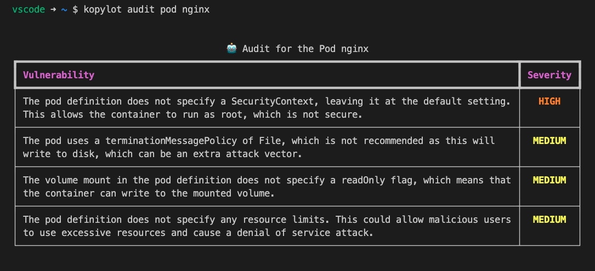
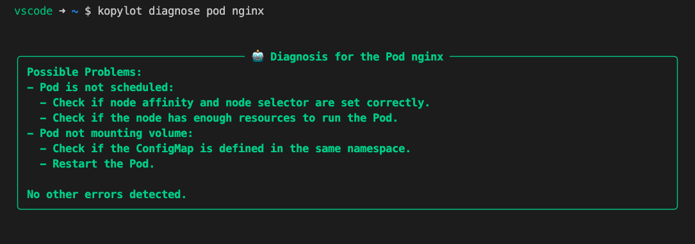
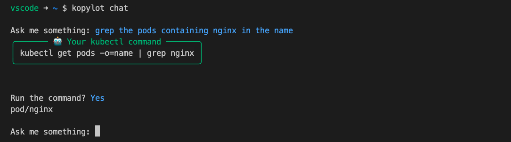
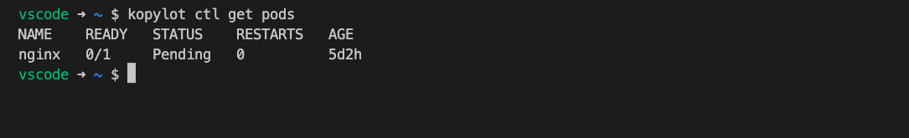

# **KoPylot**: Your AI-Powered Kubernetes Assistant 🤖

[](https://img.shields.io/github/v/release/avsthiago/kopylot)
[](https://github.com/avsthiago/kopylot/actions/workflows/main.yml?query=branch%3Amain)
[](https://codecov.io/gh/avsthiago/kopylot)
[](https://img.shields.io/github/commit-activity/m/avsthiago/kopylot)
[](https://img.shields.io/github/license/avsthiago/kopylot)

Kopylot is an open-source AI-powered Kubernetes assistant. Its goal is to help developers and DevOps engineers to easily manage and monitor their Kubernetes clusters. 

KoPylot's idea is similar to [Kopilot](https://github.com/knight42/kopilot) from knight42. The main difference at the moment is the usage of Python for implementing it. 

> *Note from the author*: I decided to create a new project instead of contributing to Kopilot mainly because I am a Python developer, and Kopilot is written in Go. I also believe that the tools for interacting with large language models are more mature in the Python ecosystem.

## 💫 Features:

- 🔍 **Audit**: Audit a resources e.g. pods, deployments, or services using an LLM model.


- 🩺 **Diagnose**: Diagnose resources e.g. pods, deployments, or services using an LLM model.


- 💬 **Chat**: Start a chat with kopylot to generate kubectl commands based on your prompts.


- ☸️ **Ctl**: A wrapper around kubectl. The arguments passed to the `ctl` subcommand are interpreted by kubectl.



## 🚀 Quick Start:

1. Requests an API key from [OpenAI](https://help.openai.com/en/articles/4936850-where-do-i-find-my-secret-api-key).
2. Export the key using the following command:

```bash
export KOPYLOT_AUTH_TOKEN=your_api_key
```
3. Install Kopylot using pip:
```
pip install kopylot
```

4. Run Kopylot:
```
kopylot --help
```


## 📖 Usage:

```
Usage: kopylot [OPTIONS] COMMAND [ARGS]...                                           
                                                                                      
╭─ Options ──────────────────────────────────────────────────────────────────────────╮
│ --version                                                                          │
│ --install-completion        [bash|zsh|fish|powershell  Install completion for the  │
│                             |pwsh]                     specified shell.            │
│                                                        [default: None]             │
│ --show-completion           [bash|zsh|fish|powershell  Show completion for the     │
│                             |pwsh]                     specified shell, to copy it │
│                                                        or customize the            │
│                                                        installation.               │
│                                                        [default: None]             │
│ --help                                                 Show this message and exit. │
╰────────────────────────────────────────────────────────────────────────────────────╯
╭─ Commands ─────────────────────────────────────────────────────────────────────────╮
│ audit     Audit a pod, deployment, or service using an LLM model.                  │
│ chat      Start a chat with kopylot to generate kubectl commands based your        │
│           inputs.                                                                  │
│ ctl       A wrapper around kubectl. The arguments passed to the ctl subcommand are │
│           interpreted by kubectl.                                                  │
│ diagnose  Diagnose a resource e.g. pod, deployment, or service using an LLM model. │
╰────────────────────────────────────────────────────────────────────────────────────╯
```


## 🤝 Contributions: 
Kopylot is an open-source project and we welcome contributions from the community. There are a couple of ways to set up your development environment and start contributing to the project.

### 🐳 Using a Dev Container
KoPylot supports development using a dev container, which helps you set up a consistent and isolated environment for development. This makes it easy to get started without having to worry about conflicting dependencies or configurations on your local machine.

**To get started with a dev container:**

1. Install [Docker](https://www.docker.com/) and [Visual Studio Code](https://code.visualstudio.com/).
2. Install the [Remote - Containers](https://marketplace.visualstudio.com/items?itemName=ms-vscode-remote.remote-containers) extension in Visual Studio Code.
3. Clone the KoPylot repository and open the project folder in Visual Studio Code.
4. Press `F1`, type `Remote-Containers: Reopen in Container`, and hit `Enter`. Visual Studio Code will build the dev container and reopen the project inside it.

You're now ready to start contributing to KoPylot using the dev container!

### 🛠️ Local Setup

If you prefer to set up your development environment locally, make sure you have [Poetry](https://python-poetry.org/) installed on your system. Then, follow these steps:

1. Clone the KoPylot repository:

   ```bash
   git clone https://github.com/avsthiago/kopylot
   ```

2. Navigate to the project folder:

   ```bash
   cd kopylot
   ```

3. Install the project dependencies using Poetry:

   ```go
   make install
   ```

You're now ready to start contributing to KoPylot using your local setup! 😄

Before submitting a pull request, please make sure to test your changes and follow the project's coding guidelines. We appreciate your contributions and look forward to collaborating with you! 🎉


## 📄 License:

Kopylot is licensed under the MIT License. See [LICENSE](LICENSE) for more information.


## ☎️ Contact: 

If you have any questions or suggestions, feel free to contact me on [https://thiagoalves.ai](https://thiagoalves.ai/contact/).

Thank you for using Kopylot! 🙌

## 🗺️ Roadmap:

- [x] Wrap the kubectl command using `ctl` subcommand.
- [x] Create the `audit` subcommand to audit kubernetes resources.
- [x] Create the `diagnose` subcommand to diagnose kubernetes resources.
- [x] Create the `chat` subcommand to generate kubectl commands using from the user prompts.
- [ ] Make it possible to use other LLM models, not just from OpenAI.
- [ ] Integrate [LangChain](https://github.com/hwchase17/langchain) into Kopylot to make it as autonomous as possible.